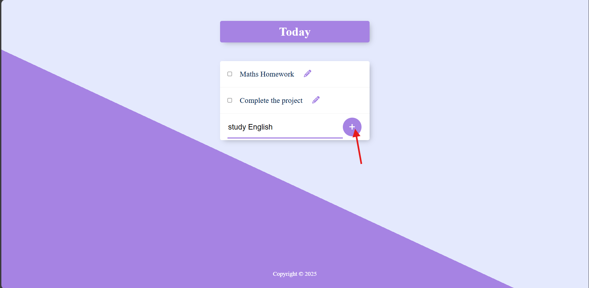
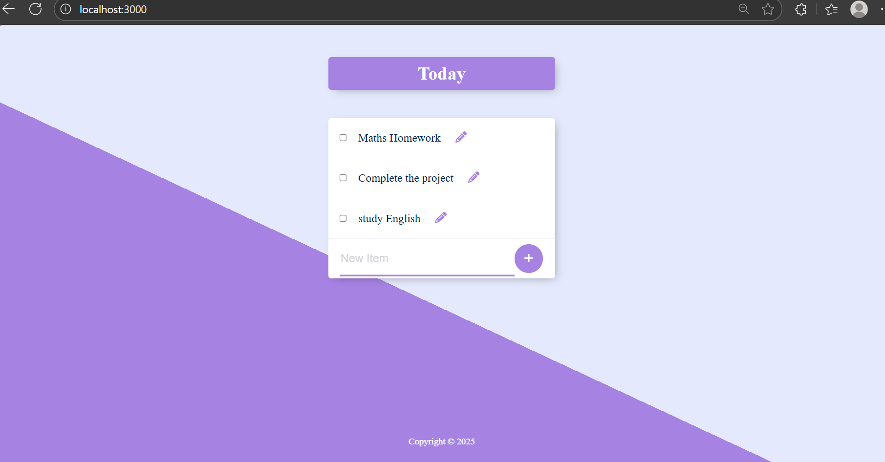
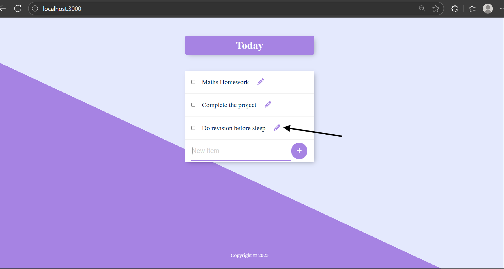
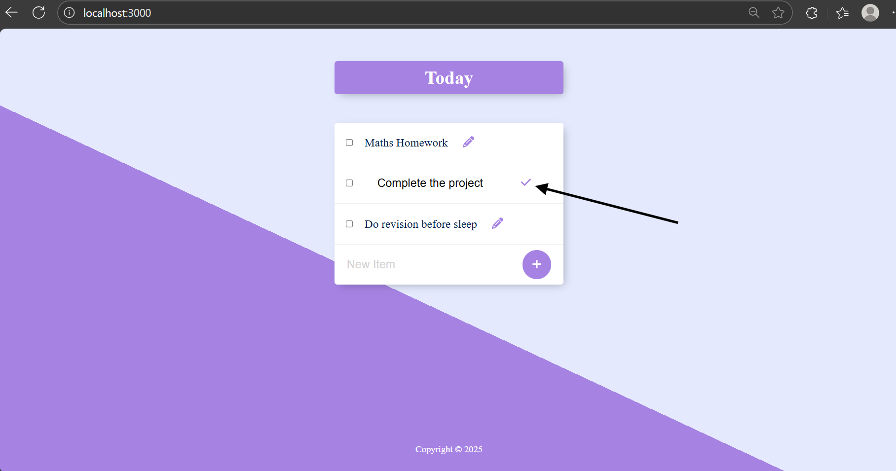
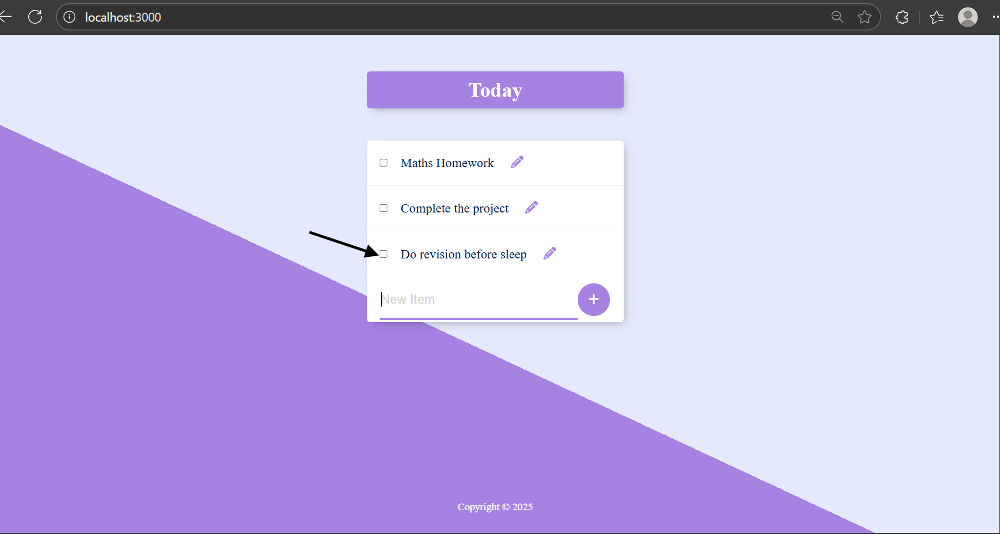
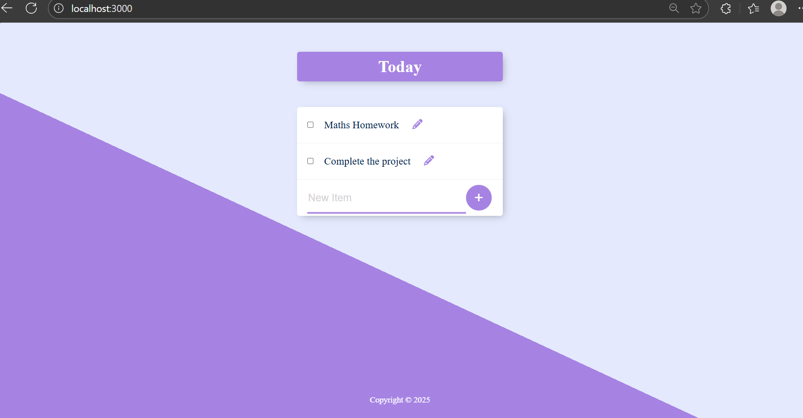

# To-Do List Application

A simple **CRUD To-Do List Application** built with **Node.js**, **Express**, **PostgreSQL**, and **EJS**.  
This app allows users to add, edit, and delete tasks, with data stored persistently in a PostgreSQL database.

## Features
- **Add** new to-do items.
- **Edit** existing items.
- **Delete** items when completed or no longer needed.
- Data is stored persistently in a PostgreSQL database.
- Responsive front-end rendering using EJS templates.

# Preview

### Add Item



### Edit Item



### Delete Item



---


## Tech Stack
- **Backend:** Node.js, Express.js
- **Database:** PostgreSQL
- **Templating Engine:** EJS
- **Other Packages:** body-parser, pg

## Database Setup
Run the following SQL to create the `items` table and insert some sample data:

```sql
CREATE TABLE items (
  id SERIAL PRIMARY KEY,
  title VARCHAR(100) NOT NULL
);

INSERT INTO items (title) VALUES ('Buy milk'), ('Finish homework');
```
##Folder Structure
.
├── index.js            # Main server file
├── queries.sql         # Database schema and sample data
├── package.json        # Project dependencies
├── public/             # Static assets
├── views/              # EJS templates
└── preview/             # Preview screenshots

License

This project is licensed under the ISC License.


